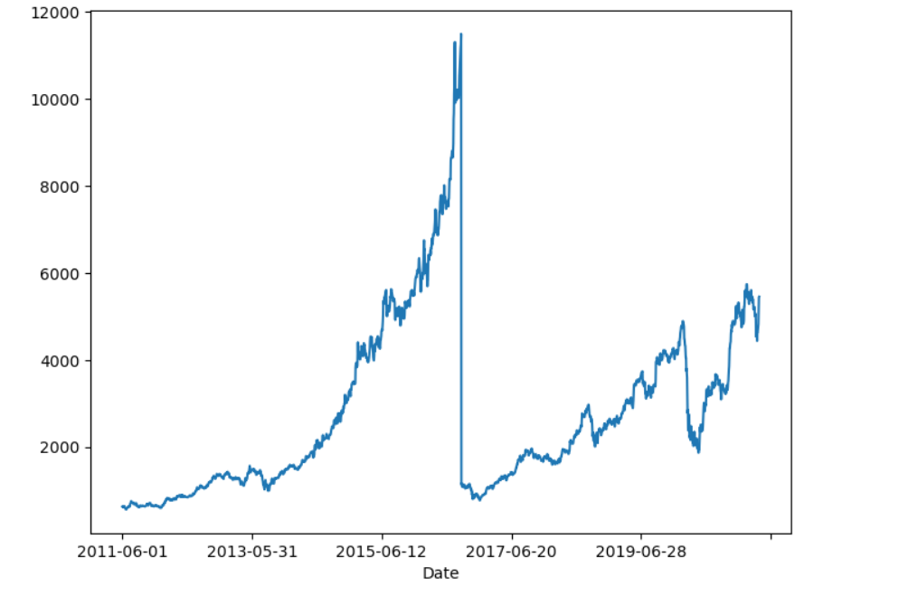
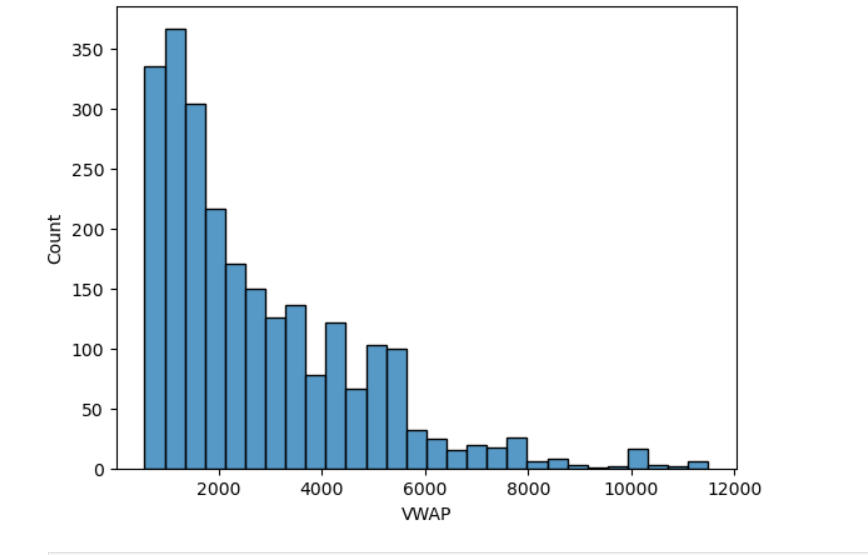
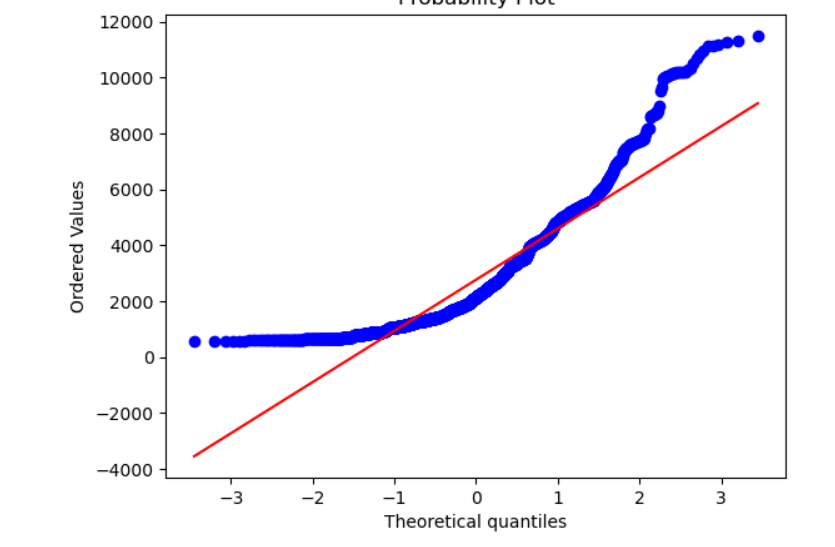
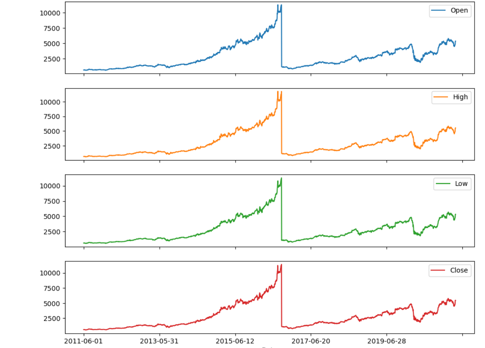
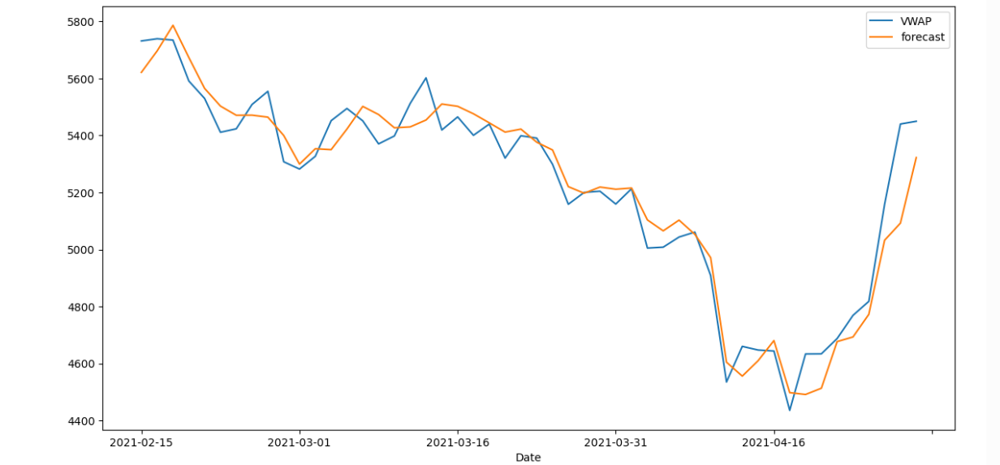

# 📈 Stock Price Prediction using Time Series Analysis

## 📌 Project Overview
This project focuses on **time series forecasting** using historical stock market data.  
The objective is to **predict the Volume Weighted Average Price (VWAP)** of a stock based on past price-related features.

The project demonstrates a **real-world financial time series use case**, covering data understanding, preprocessing, exploratory analysis, feature engineering, model building, and evaluation.

---

## 🏦 Business Problem
Given historical stock data of **Bajaj Finance**, predict the **VWAP (Volume Weighted Average Price)** for a given date using time-dependent features.

Accurate VWAP prediction helps in:
- Better trading decisions  
- Market trend analysis  
- Financial forecasting  

---

## 📂 Dataset Description
The dataset contains **date-wise stock price information** with the following features:

### Independent Features
- Date  
- Previous Close  
- Open Price  
- High Price  
- Low Price  
- Last Price  
- Close Price  

### Target Variable
- **VWAP (Volume Weighted Average Price)**

---

## 🧠 Project Workflow
The project follows the standard **Data Science & Time Series lifecycle**:

1. Business Understanding  
2. Data Collection & Cleaning  
3. Exploratory Data Analysis (EDA)  
4. Feature Engineering  
5. Time Series Modeling  
6. Model Evaluation  
7. Forecasting  

---

## 🔍 Exploratory Data Analysis (EDA)
- Trend analysis of stock prices  
- Date-wise price movement visualization  
- Correlation between features  
- Identification of patterns and seasonality  

Visualization libraries used:
- Matplotlib  
- Seaborn  

---

## ⚙️ Feature Engineering
- Date-based feature extraction  
- Lag features  
- Handling missing values  
- Scaling numerical features  

---

## 🤖 Models Used
The following time series / statistical techniques are applied:

- ARIMA / Auto-ARIMA  
- Statistical forecasting methods  

Libraries used:
- `pandas`
- `numpy`
- `statsmodels`
- `pmdarima`
- `matplotlib`
- `seaborn`

---

## 📊 Model Evaluation
Model performance is evaluated using:
- Forecast accuracy
- Error metrics (MAE / RMSE where applicable)
- Visual comparison of actual vs predicted values  

---

## 🚀 How to Run the Project

### 1️⃣ Open Anaconda Navigator  
### 2️⃣ Launch Jupyter Notebook  
### 3️⃣ Open the notebook:

## Expected Outcomes

Understand real-world financial time series data

Learn EDA for time series

Apply ARIMA-based forecasting

Build an end-to-end stock price prediction pipeline

## 📊 Notebook Outputs – Stock Price Analysis

The following visual outputs are generated from the Jupyter Notebook  
**`StockPricePrediction.ipynb`**.

---

### 📈 Output 1: Historical Stock Price Trend
**Image:** `stock1.png`

Displays the **historical closing price trend** of NIFTY / Bajaj stock over time.  
Helps understand long-term movement and overall market behaviour.

---

### 📉 Output 2: Trend & Rolling Statistics
**Image:** `stock2.png`

Shows **rolling mean and rolling standard deviation**.  
Used to check **stationarity** of the time-series data.

---

### 📊 Output 3: Differenced Time Series
**Image:** `stock3.png`

Displays the **differenced series** to remove trend and make data stationary.  
This step is required before ARIMA-based forecasting.

---

### 📆 Output 4: Model Forecast vs Actual
**Image:** `stock4.png`

Compares **actual stock prices vs predicted values** generated by the  
time-series forecasting model (ARIMA).

---

### 🔮 Output 5: Future Price Forecast
**Image:** `stock5.png`

Shows **future stock price predictions** for upcoming days based on the trained model.  
Used for decision-making and trend anticipation.

---

## ✅ Technical Summary
- Time-series data preprocessing using Pandas
- Stationarity check using rolling statistics & differencing
- Forecasting using **ARIMA model**
- Visualization using Matplotlib
- Model deployed-ready notebook structure

##  🔮 Future Enhancements

LSTM / Deep Learning models

Multi-step forecasting

Live stock data integration

Model deployment as a web app
